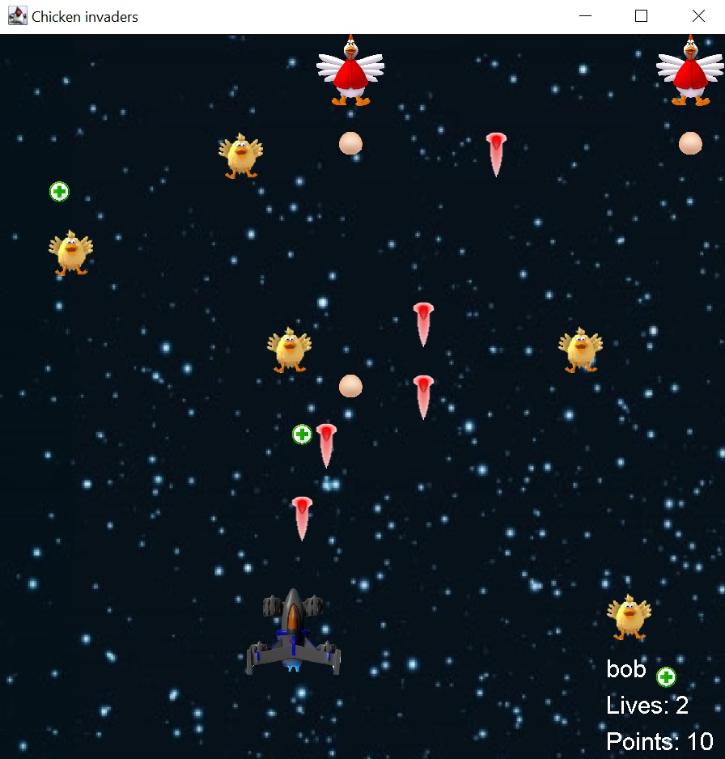

# Chicken-Invaders
This is a space shooter game in which you shoot space chickens flying in your starship.

 

## How to play
* In the main menu you can press "New game" and then enter player's name in the smaller window or load a game that was saved before. You can also display the high scores table.
* During the game you have to shoot the chickens. If you hit the chicken you lose one life.
* It is possible to gain additional lives by collecting the small "crosses".
* To use big laser weapon press space.
* After you gain 25 points your starship gets an upgrade.
* To save the game press 's'.
* To pause the game press 'p'.
* To win the game you need to collect 50 points.

## Technologies
* Java 15

